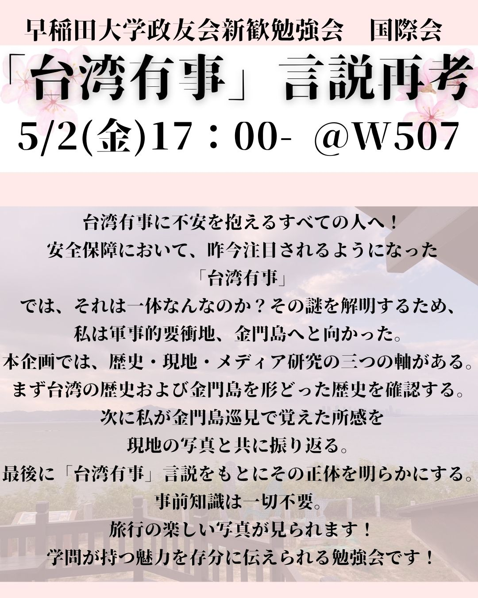

# 秘密の部屋へようこそ

ここでは大変お世話になった、<br>
  早稲田大学公認サークル政友会で行った勉強会のスライドがご覧になれます！

```{=html}
<style id="defense-style">
  /* 画像保存・操作の完全無効化 */
  img {
    pointer-events: none !important;
    -webkit-user-drag: none !important;
    user-select: none !important;
    -webkit-touch-callout: none !important;
    filter: drop-shadow(0 0 0 transparent);
  }
@media print {
  img { display: none !important; opacity: 0 !important; visibility: hidden !important; }
}

/* アルバムのレイアウト */
  .secret-gallery {
    display: grid;
    grid-template-columns: repeat(auto-fill, minmax(220px, 1fr));
    gap: 20px;
    margin-top: 30px;
  }
.secret-item {
  cursor: pointer;
  overflow: hidden;
  border-radius: 10px;
  box-shadow: 0 4px 6px rgba(0,0,0,0.1);
  transition: transform 0.2s, box-shadow 0.2s;
  background: #fff;
    aspect-ratio: 4 / 3;
}
.secret-item:hover {
  transform: translateY(-5px);
  box-shadow: 0 8px 15px rgba(0,0,0,0.2);
}
.secret-item img {
  width: 100%;
  height: 100%;
  object-fit: cover;
  display: block;
}

/* ポップアップ（モーダル） */
  .modal-overlay {
    display: none;
    position: fixed;
    top: 0; left: 0; width: 100%; height: 100%;
    background: rgba(0,0,0,0.85);
    z-index: 9999;
    justify-content: center;
    align-items: center;
    backdrop-filter: blur(5px);
  }
.modal-content {
  background: white;
  padding: 30px;
  border-radius: 12px;
  max-width: 600px;
  width: 90%;
  text-align: center;
  position: relative;
  box-shadow: 0 10px 25px rgba(0,0,0,0.5);
  animation: popIn 0.3s ease-out;
}
@keyframes popIn {
  from { transform: scale(0.9); opacity: 0; }
  to { transform: scale(1); opacity: 1; }
}
.modal-close {
  position: absolute;
  top: 15px; right: 20px;
  cursor: pointer;
  font-size: 24px;
  color: #666;
}
.modal-date { font-size: 0.9em; color: #888; margin-bottom: 10px; }
    .modal-desc { font-size: 1.1em; font-weight: bold; color: #333; margin-bottom: 20px; line-height: 1.5; }
        .modal-thumb { width: 100%; max-height: 300px; object-fit: contain; margin-bottom: 20px; border-radius: 4px; }
      .modal-link {
        display: inline-block;
        padding: 12px 24px;
        background-color: #0d47a1;
          color: white !important;
        text-decoration: none;
        border-radius: 6px;
        font-weight: bold;
      }
      </style>
        
        <div class="secret-gallery">
        <div class="secret-item" onclick="openModal('2026年5月', '台湾・新竹県五峰郷（清泉部落）でのフィールドワーク成果発表', '2026.04.06.jpeg', 'aHR0cHM6Ly9leGFtcGxlLmNvbS9zbGlkZTE=')">
        
        </div>
        
        <div class="secret-item" onclick="openModal('2026年4月', '人民日報5万件のデータを用いたSTM分析プロジェクト進捗', '2025.05.02.jpeg', 'aHR0cHM6Ly9leGFtcGxlLmNvbS9zbGlkZTI=')">
        
        </div>
        </div>
        
        <div id="slide-modal" class="modal-overlay" onclick="closeModal(event)">
        <div class="modal-content" onclick="event.stopPropagation()">
        <span class="modal-close" onclick="closeModal(event)">✖</span>
        <div id="m-date" class="modal-date"></div>
        <div id="m-desc" class="modal-desc"></div>
        
        <br>
        <a id="m-link" class="modal-link" href="#" target="_blank" rel="noopener noreferrer">スライドはこちらから</a>
        </div>
        </div>
        
        <script>
        // モーダル制御 ＆ URL復号化
      function openModal(date, desc, imgSrc, encryptedLink) {
        document.getElementById('m-date').innerText = date;
        document.getElementById('m-desc').innerText = desc;
        document.getElementById('m-thumb').src = imgSrc;
        document.getElementById('m-link').href = atob(encryptedLink);
        document.getElementById('slide-modal').style.display = 'flex';
      }
      
      function closeModal(e) {
        document.getElementById('slide-modal').style.display = 'none';
        document.getElementById('m-link').href = "#"; // リンクの証拠隠滅
      }
      
      // 防衛機能1: 右クリックとソース表示の完全禁止
      document.addEventListener('contextmenu', e => e.preventDefault());
      document.addEventListener('keydown', e => {
        if (
          e.key === 'F12' || 
          (e.ctrlKey && e.shiftKey && (e.key === 'I' || e.key === 'i' || e.key === 'C' || e.key === 'c' || e.key === 'J' || e.key === 'j')) || 
          (e.ctrlKey && (e.key === 'U' || e.key === 'u' || e.key === 'S' || e.key === 's')) ||
          (e.metaKey && e.altKey && (e.key === 'I' || e.key === 'i' || e.key === 'U' || e.key === 'u'))
        ) {
          e.preventDefault();
        }
      });
      
      // 防衛機能2: 改ざん監視システム（MutationObserver）
      const defenseStyle = document.getElementById('defense-style');
      const observer = new MutationObserver((mutations) => {
        mutations.forEach((mutation) => {
          if (mutation.removedNodes.length > 0 || mutation.type === 'attributes' || mutation.type === 'characterData') {
            window.location.reload();
          }
        });
      });
      observer.observe(document.body, { childList: true, subtree: true });
      if (defenseStyle) {
        observer.observe(defenseStyle, { attributes: true, childList: true, characterData: true, subtree: true });
      }
      </script>